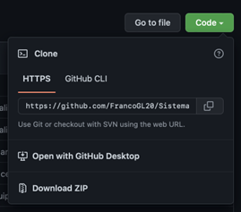
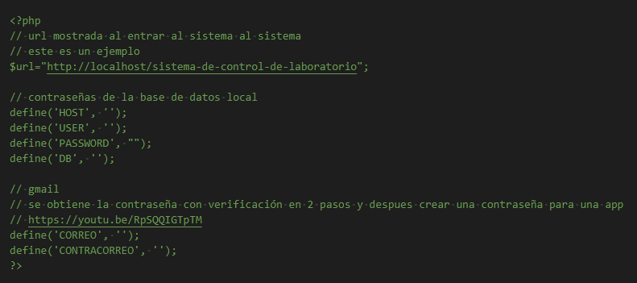

# Sistema-de-control-de-laboratorio

Creación de un sistema de control de laboratorio que permita hacer la emisión de certificados de calidad en una fabrica de harina y envie los certificados con los resultados de los analisis tomando en cuenta

## Proceso de instalación

1. Entrar al link del repositorio en GitHub
2. En el apartado Code, seleccionar la opción “Descargar zip”, descomprimir el archivo y mover la carpeta a una dirección deseada (por ejemplo: htdocs para Xampp)

    
3. En la carpeta DB se encuentra un archivo *.sql el cual contiene el script de la base de datos, en el administrador de base de datos usado, importar el archivo para tener la base de datos completa, este puede ayudar en el paso 6 con el nombre de la base de datos
4. Una vez teniendo las carpetas y archivos necesarios, entrar a config/README.md y copiar el contenido del código

    
5. Crear un archivo config.php en el directorio config/ y pegar en él todo lo copiado en el paso 4
6. En el archivo config.php rellenar los espacios necesarios en cada define dependiendo del contenido que se necesita, como los datos para entrar a la base de datos
   1. la variable $url contiene un ejemplo de uso, en esta se coloca la url raíz del localhost hacia la carpeta donde se encuentra el sistema, solo se copia la url que se obtiene de entrar manualmente
   2. en el caso de las contraseñas de GMAIL para enviar correo, ver el video cuyo link está arriba dentro del código

## Documentación del proyecto 📖

[Link a directorio en drive](https://drive.google.com/drive/folders/1EBjgUyODvWZC-7yEsDODKz5nqm2O_V1_?usp=sharing) donde está toda la documentación de la elaboración del proyecto completa, los que incluye:

1. Requerimientos funcionales
2. Diseño arquitectónico
3. Diseño técnico
4. Construcción del programa

## Autores del proyecto

- Oscar Alexander Robles Braun
- Francisco Gutiérrez López
- José María Macías

## Licencia

MIT
